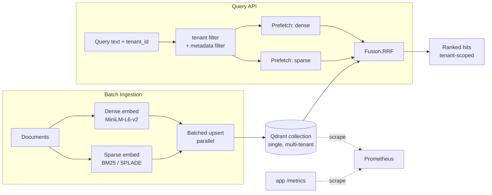

# tenantq

**A production-shaped, multi-tenant hybrid-search reference deployment on [Qdrant](https://qdrant.tech) — tenant-isolated retrieval, dense + sparse fusion, HNSW tuning, and a real recall/latency benchmark harness.**

tenantq is the answer to "how do I actually deploy and *tune* Qdrant for production RAG/search?" It is a small, fully runnable codebase that wires together the things real deployments need and too many demos skip: strict per-tenant isolation, hybrid retrieval with server-side fusion, metadata filtering on payload indexes, HNSW build/query tuning, batched ingestion with throughput reporting, Prometheus metrics, Docker, and a benchmark that prints **real Recall@K and p50/p95/p99 numbers** you can reproduce.

---

## Why it exists

Most vector-search examples index one flat collection and call `search()`. Production looks different:

- Many tenants share one cluster, and **tenant A must never see tenant B's data**.
- Pure dense retrieval misses exact-term matches; pure keyword misses semantics. You want **both, fused**.
- HNSW has knobs (`m`, `ef_construct`, `hnsw_ef`) that trade recall for latency and memory — you need to *measure* them.
- You need to know your **recall and tail latency**, not vibes.

tenantq demonstrates all of this with code that runs end to end on your laptop.

## Architecture



**Multitenancy.** One collection holds every tenant's vectors. A keyword payload
index on `tenant_id` is created with `is_tenant=True`, and HNSW is configured for
multitenancy: the global graph is disabled (`m=0`) and per-tenant sub-graphs are
built via `payload_m`. Every single query carries a mandatory `Filter` on
`tenant_id`, so cross-tenant reads are structurally impossible (there is a test
that proves it). This is Qdrant's recommended multitenant layout: cheaper than a
collection-per-tenant and strictly isolated.

**Hybrid retrieval.** Dense vectors come from `fastembed`
(`sentence-transformers/all-MiniLM-L6-v2`), sparse from fastembed's
`SparseTextEmbedding` (`Qdrant/bm25`, IDF modifier). Hybrid search uses the Qdrant
**Query API**: two `Prefetch` branches (dense + sparse, each tenant-filtered) fused
server-side with **Reciprocal Rank Fusion** (`Fusion.RRF`). Dense-only and
sparse-only modes are exposed too, so the benchmark can compare all three.

**Metadata filtering.** Payload indexes on `category` (keyword) and `created_at`
(integer, range-enabled) back filtered search exposed in both the CLI and API.

## Quickstart

```bash
python -m venv .venv && source .venv/bin/activate
pip install -e ".[dev]"

# Run the real benchmark (downloads the embedding models on first run).
tenantq benchmark --embedder fastembed

# Fully offline (deterministic hash embedder, no downloads) — used by CI/tests:
tenantq benchmark --embedder hash

# One-off tenant-scoped search against an ingested collection:
tenantq search "vector similarity ranking" --tenant acme --mode hybrid
```

By default everything runs against an in-process Qdrant (`:memory:`), which
supports sparse vectors and Query API fusion — so the benchmark produces genuine
numbers with zero infrastructure. Point at a real server by setting `QDRANT_URL`
(see Docker below).

## Configuration

Everything is env-overridable (`Settings.from_env()`) or a CLI flag:

| Setting | Env | Default | Effect |
| --- | --- | --- | --- |
| collection | `TENANTQ_COLLECTION` | `tenantq` | collection name |
| HNSW `m` | `TENANTQ_HNSW_M` | 16 | graph degree (build); higher = better recall, more memory |
| `ef_construct` | `TENANTQ_HNSW_EF_CONSTRUCT` | 100 | build-time search breadth; higher = better graph, slower build |
| `hnsw_ef` | `TENANTQ_HNSW_EF` | 64 | **query**-time breadth; higher = better recall, slower query |
| multitenant | `TENANTQ_MULTITENANT` | 1 | global `m=0` + per-tenant `payload_m` |
| `payload_m` | `TENANTQ_PAYLOAD_M` | 16 | per-tenant sub-graph degree |
| server URL | `QDRANT_URL` | — | use a real Qdrant instead of local mode |
| local path | `TENANTQ_QDRANT_PATH` | — | on-disk local store |

**HNSW tradeoffs.** `m` and `ef_construct` shape the index at build time (recall
ceiling, memory, build cost). `hnsw_ef` is the runtime lever: raise it to buy
recall at the cost of latency. The benchmark's `--sweep` flag runs several
`hnsw_ef` values so you can see the curve for your data.

## Running the benchmark

```bash
tenantq benchmark --embedder fastembed --sweep
```

This ingests a synthetic **labeled** corpus (documents grouped by tenant + topic,
so ground-truth relevance is known), computes an **exact brute-force** cosine
top-K as an index-recall reference, then for each mode reports **Recall@5**,
**Recall@10**, dense **index recall vs exact**, **p50/p95/p99** latency, and QPS,
plus ingestion throughput. See [`BENCHMARKS.md`](BENCHMARKS.md) for real numbers
from an actual run.

## Docker

```bash
docker compose up --build
```

Brings up **Qdrant**, the **tenantq app** (runs a benchmark against the server
then serves `/metrics` on `:8001`), and **Prometheus** (`:9090`) scraping both.
`prometheus.yml` holds the scrape config. The app reads `QDRANT_URL=http://qdrant:6333`.

## Kubernetes

The same stack runs on Kubernetes. Manifests for the `tenantq` namespace (Qdrant
`Deployment` + `Service` + `PersistentVolumeClaim`, the tenantq workload wired to
the Qdrant `Service`, and Prometheus scraping it) live in [`k8s/`](k8s/), with a
one-command `kind` walkthrough. Verified end to end: the workload ingests the
corpus into the in-cluster Qdrant and Prometheus scrapes its recall/latency
metrics.

## Metrics

`prometheus_client` exposes on `/metrics`:

- `tenantq_query_latency_seconds` — histogram, labeled by mode
- `tenantq_ingested_points_total` — counter, labeled by tenant
- `tenantq_recall` — gauge, labeled by mode and k
- `tenantq_ingest_throughput_points_per_second` — gauge

## Tests

```bash
pytest
```

Covers tenant-isolation (including a cross-tenant leak test), all three search
modes, category + time-range filtering, and benchmark/metric correctness. Tests
use the offline hash embedder and in-memory Qdrant, so they need no network.

## Layout

```
src/tenantq/
  config.py       settings + HNSW/tenancy config
  embeddings.py   dense+sparse backends (fastembed / offline hash)
  client.py       local / on-disk / server client factory
  collection.py   collection creation, payload indexes, multitenant HNSW
  data.py         synthetic labeled dataset + ground truth
  ingest.py       batched parallel upsert + throughput
  search.py       dense / sparse / hybrid (RRF), tenant + metadata filters
  benchmark.py    recall@k, exact reference, latency percentiles
  metrics.py      Prometheus metrics
  cli.py          Typer CLI
```

## License

MIT © royalpinto007
